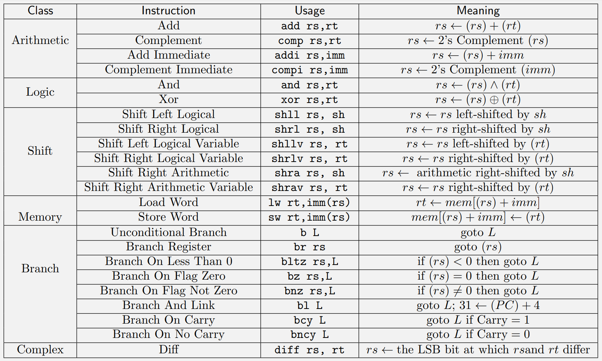
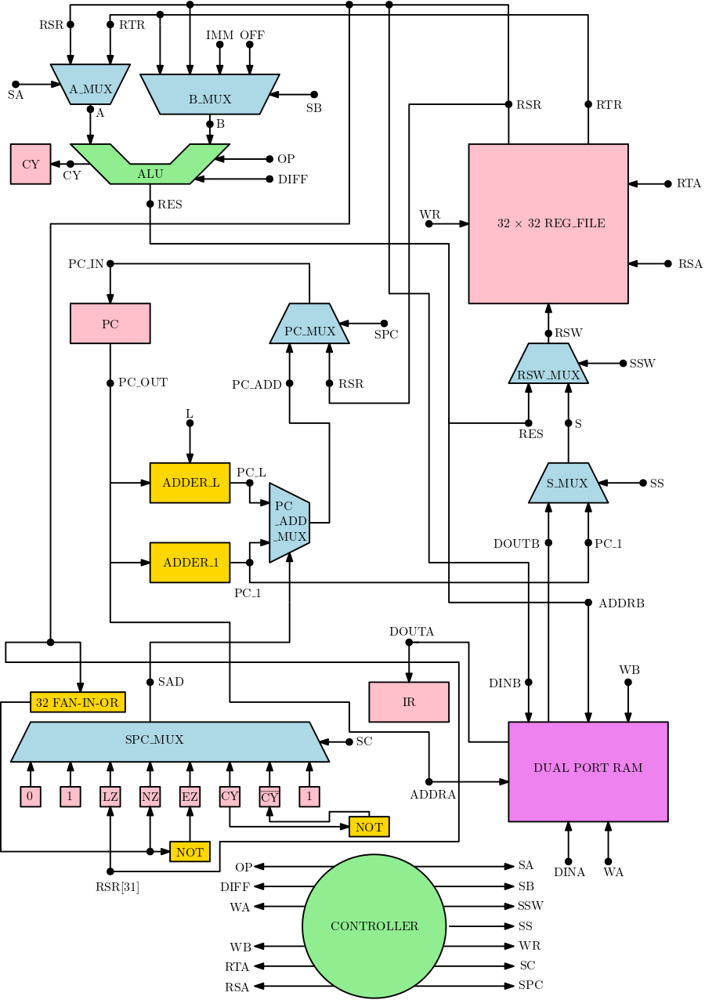

# miniRISC Processor Design - Project Description

### The repository for the project is available at https://github.com/frediff/miniRISC

## miniRISC 

Our processor miniRISC has the following Instruction Set Architecture (ISA). The processor has a 32 bit word, with all the registers and memory elements having 32 bit data. We develop first the op-code format for the above instruction set, identify the data path element and design the data path along with the control signals. Subsequently, we develop a single-cycle instruction execution unit for miniRISC.

#### The Instruction Set Architecture

#### Design

#### Contributors

- Subham Ghosh (Roll No.: 20CS10065)
- Anubhav Dhar (Roll No.: 20CS30004)
